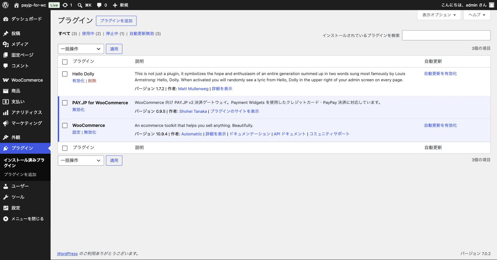
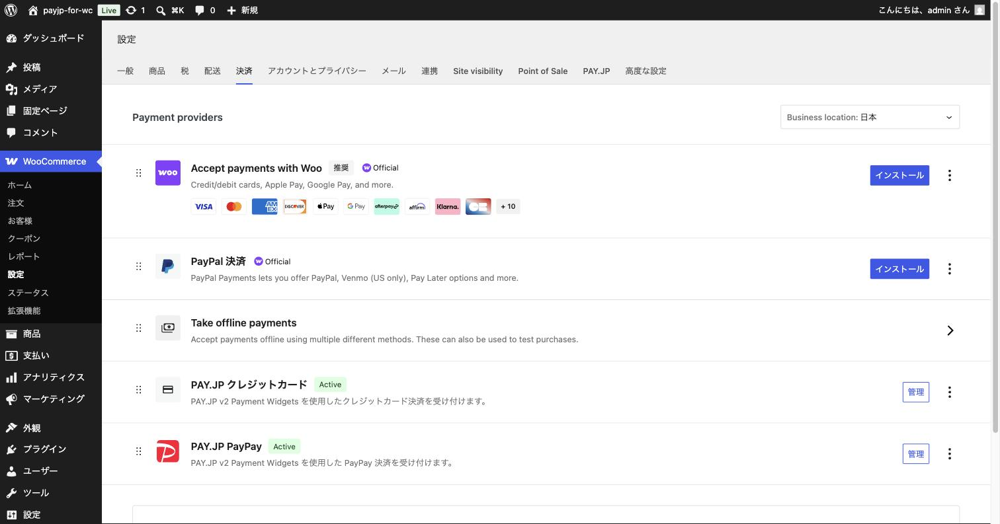

# 第3章 プラグインのインストール

WordPress の管理画面から「PAY.JP for WooCommerce」プラグインをインストールして有効化します。

> [!NOTE]
> 事前に WooCommerce プラグインがインストール・有効化されている必要があります。まだの場合は先に WooCommerce をインストールし、ショップの初期設定（店舗の住所・通貨など）を済ませてください。

## 3-1. 管理画面からインストールする（おすすめ）

1. WordPress 管理画面に管理者権限のあるユーザーでログインします。
2. 左メニューの「**プラグイン**」→「**新規プラグインを追加**」をクリックします。
3. 右上の検索ボックスに「**PAY.JP for WooCommerce**」と入力します。
4. 検索結果に表示された「PAY.JP for WooCommerce」の「**今すぐインストール**」をクリックします。
5. インストールが終わるとボタンが「**有効化**」に変わるので、クリックして有効化します。

## 3-2. ZIP ファイルからインストールする場合

配布された ZIP ファイルを持っている場合は、次の手順でもインストールできます。

1. 「**プラグイン**」→「**新規プラグインを追加**」→ 画面上部の「**プラグインのアップロード**」をクリックします。
2. 「ファイルを選択」で ZIP ファイルを選び、「**今すぐインストール**」をクリックします。
3. インストール後、「**プラグインを有効化**」をクリックします。

## 3-3. 有効化されたか確認する

「プラグイン」→「インストール済みプラグイン」を開き、「PAY.JP for WooCommerce」が有効（背景に色が付いた状態）になっていれば OK です。

## 3-4. 決済一覧に表示されたか確認する

1. 左メニューの「**WooCommerce**」→「**設定**」を開きます。
2. 上部のタブから「**決済**」をクリックします。
3. 決済手段の一覧に「**PAY.JP クレジットカード**」と「**PAY.JP PayPay**」が表示されていれば、インストールは成功です。

> [!NOTE]
> この時点ではまだ API キーを設定していないため、ショップのチェックアウト画面には表示されません。次の章で設定を行います。

---

次の章 → [第4章 プラグインの設定](04-settings.md)
