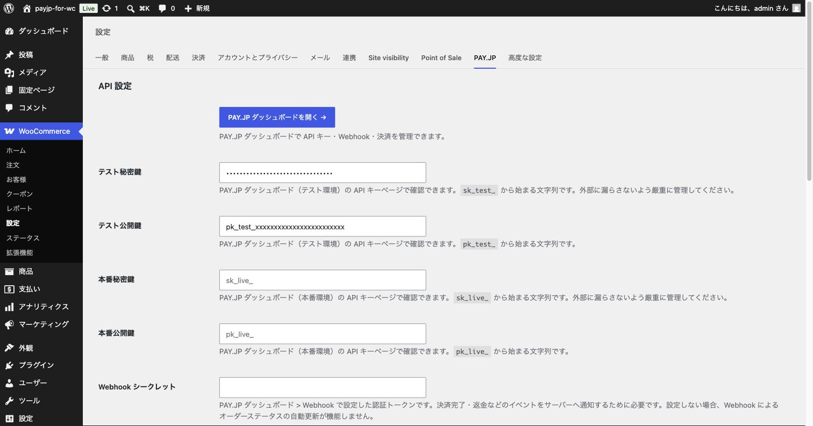
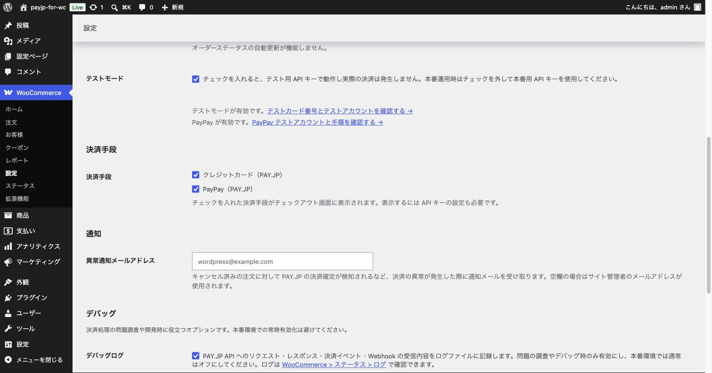
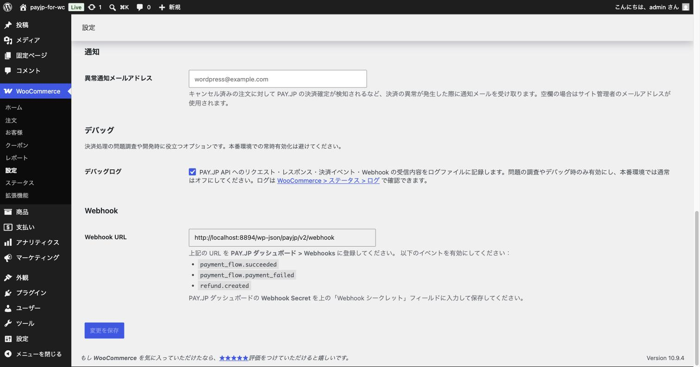
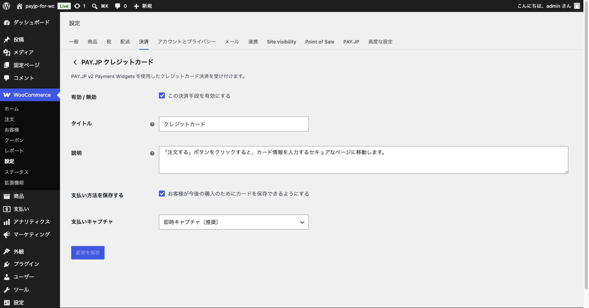
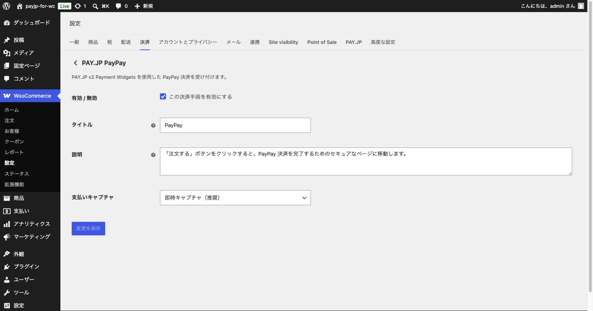

# 第4章 プラグインの設定

この章では、テスト環境で決済を動かすための設定を行います。**まずはテストモードのまま**設定を進めてください（本番への切り替えは第6章で行います）。

## 4-1. 設定画面を開く

1. WordPress 管理画面で「**WooCommerce**」→「**設定**」を開きます。
2. 上部のタブから「**PAY.JP**」をクリックします。

PAY.JP の共通設定画面が表示されます。ここで入力する API キーやテストモードの設定は、クレジットカード・PayPay の両方に共通で使われます。

## 4-2. テスト用 API キーを入力する

第2章で確認したテスト用の API キーを入力します。

1. PAY.JP ダッシュボードの「API」ページを別のタブで開き、キーをコピーします。
2. プラグイン設定画面の各欄に貼り付けます。

| 設定項目 | 入力する値 |
|----------|-----------|
| **テスト秘密鍵** | `sk_test_` から始まる文字列 |
| **テスト公開鍵** | `pk_test_` から始まる文字列 |
| 本番秘密鍵 / 本番公開鍵 | **今は空欄のまま** で OK（第6章で入力します） |

> [!TIP]
> キーをコピーするときは、前後に余分なスペースが入らないように注意してください。キーの取り違え（テスト用の欄に本番用を入れる等）もよくある間違いです。`sk_test_`・`pk_test_` という先頭の文字をよく確認しましょう。

## 4-3. テストモードを確認する

画面を下にスクロールすると「**テストモード**」のチェックボックスがあります。

- **チェックが入っている（初期状態）** … テスト用 API キーで動作し、実際のお金は動きません。**この章ではチェックを入れたままにしてください。**
- チェックを外すと本番用キーで動作します（第6章で切り替えます）。

テストモードが有効のときは、設定画面に「テストカード番号とテストアカウントを確認する」というリンクが表示されます。第5章のテスト決済で使うので覚えておいてください。

## 4-4. 使う決済手段を選ぶ

同じ画面の「**決済手段**」で、ショップで使いたい決済手段にチェックを入れます。

- ☑ クレジットカード（PAY.JP）
- ☑ PayPay（PAY.JP）

チェックを入れた決済手段だけが、お客様のチェックアウト画面に表示されます。

## 4-5. Webhook（ウェブフック）を設定する

**Webhook とは、PAY.JP からあなたのサイトへ「決済が完了しました」「返金されました」といった連絡を自動で送ってもらう仕組み**です。

> [!IMPORTANT]
> Webhook の設定は**必ず行ってください**。特に PayPay 決済は、支払い完了の連絡が Webhook 経由で届くため、未設定だと注文がいつまでも「保留中」のままになるなど、正しく動作しません。

### 手順

1. プラグイン設定画面の一番下にある「**Webhook**」欄に、あなたのサイト専用の **Webhook URL** が表示されています。この URL をコピーします。
   （例: `https://あなたのサイト/wp-json/payjp/v2/webhook`）

   

2. PAY.JP ダッシュボードを開き、「**Webhook**」の設定ページへ移動します。
3. 「Webhook を追加」等のボタンから、コピーした URL を登録します。
4. 受け取るイベントとして、次の 3 つを有効にします。
   - `payment_flow.succeeded`（決済の成功）
   - `payment_flow.payment_failed`（決済の失敗）
   - `refund.created`（返金の作成）
5. PAY.JP ダッシュボードに表示される「**Webhook Secret**（認証用の合言葉）」をコピーします。
6. プラグイン設定画面に戻り、「**Webhook シークレット**」欄に貼り付けます。

> [!NOTE]
> テスト環境と本番環境で Webhook の設定は別々です。第6章で本番に切り替える際に、本番環境側でも同じ登録を行います。

## 4-6. 設定を保存する

画面下の「**変更を保存**」ボタンをクリックします。これで共通設定は完了です。

## 4-7. 決済手段ごとの表示設定（任意）

チェックアウト画面に表示される名前や説明文は、決済手段ごとに変更できます。そのままでも問題ありません。

1. 「WooCommerce」→「設定」→「**決済**」タブを開きます。
2. 「PAY.JP クレジットカード」の「**管理**」をクリックします。

| 設定項目 | 説明 |
|----------|------|
| 有効 / 無効 | この決済手段を使うかどうか |
| タイトル | チェックアウト画面に表示される名前（例:「クレジットカード」） |
| 説明 | チェックアウト画面でタイトルの下に表示される説明文 |
| 支払い方法を保存する | お客様がカードを保存して次回以降の入力を省略できるようにするか |
| 支払いキャプチャ | 「**即時キャプチャ（推奨）**」のままにしてください。※「与信のみ」は発送後に売上を確定したい店舗向けの上級者設定です（第7章参照） |

PayPay も同様に「PAY.JP PayPay」の「管理」から設定できます。

---

次の章 → [第5章 テスト決済をしてみよう](05-test-payments.md)
